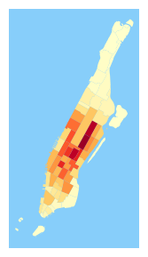
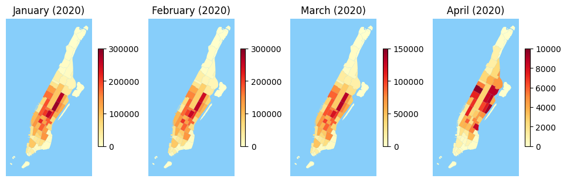
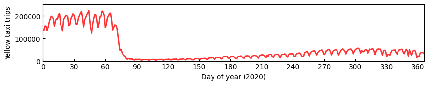
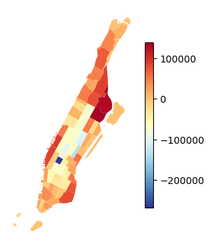
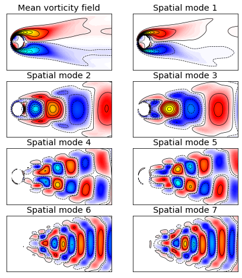

# vars
[](https://opensource.org/licenses/MIT)

[](https://github.com/xinychen/vars/archive/master.zip)
[](https://github.com/xinychen/vars)

<h6 align="center">Made by Xinyu Chen • :globe_with_meridians: <a href="https://xinychen.github.io">https://xinychen.github.io</a></h6>

The scientific question is how to **discover interpretable dynamic patterns from spatiotemporal data**. We utilize the Vector Autoregression (VAR) as a basic tool to explore the spatiotemporal data in real-world applications. [[Blog post](https://spatiotemporal-data.github.io/posts/time_varying_model/)]

```bibtex
@article{chen2023discovering,
  title={Discovering dynamic patterns from spatiotemporal data with time-varying low-rank autoregression},
  author={Chen, Xinyu and Zhang, Chengyuan and Chen, Xiaoxu and Saunier, Nicolas and Sun, Lijun},
  journal={IEEE Transactions on Knowledge and Data Engineering},
  year={2023}
}
```

<br>

## Datasets

### Fluid Dynamics

To analyze the underlying spatiotemporal patterns of fluid dynamics, we consider the cylinder wake dataset in which the flow shows a supercritical Hopf bifurcation. [The cylinder wake dataset](http://dmdbook.com/) is collected from the fluid flow passing a circular cylinder with laminar vortex shedding at Reynolds number Re = 100, which is larger than the critical Reynolds number, using direct numerical simulations of the Navier-Stokes equations. This is a representative three-dimensional flow dataset in fluid dynamics, consisting of matrix-variate time series of vorticity field snapshots for the wake behind a cylinder. The dataset is of size $199\times 449\times 150$, representing 199-by-449 vorticity fields with 150 time snapshots.


### Sea Surface Temperature

[The sea surface temperature dataset](https://psl.noaa.gov/data/gridded/data.noaa.oisst.v2.html) covers weekly means of temperature on the spatial resolution of (1 degree latitude, 1 degree longitude)-grid, and there are $180\times 360$ global grids (i.e., 64,800 grids) in total. The dataset spans a 30-year period from 1990 to 2019, and the time dimension is of length 1,565 (weeks). Therefore, the data can be represented as a matrix of size $64800\times 1565$, which seems to be high-dimensional.

### USA Surface Temperature Data

[Daymet project](https://daac.ornl.gov/DAYMET) provides long-term and continuous estimates of daily weather parameters such as maximum and minimum daily temperature for North America. There are 5,380 stations over the United States Mainland. We use the daily maximum temperature data in the United States Mainland from 2010 to 2021 (i.e., 12 years or 4,380 days in total) for evaluation. The data can be represented as a matrix of size $5380\times 4380$.

### NYC Taxi Trips

We consider to use an [NYC (yellow) taxi trip dataset](https://www1.nyc.gov/site/tlc/about/tlc-trip-record-data.page). We use 69 zones in Manhattan as pickup/dropoff zones and aggregate daily taxi trip volume of the data from 2012 to 2021. Therefore, the daily trip volume tensor is of size $69\times 69\times 3653$.

> Data folder: `../datasets/NYC-taxi/`

- Draw NYC taxi pickup trips in January 2020.

```python
import numpy as np

tensor = np.load('yellow_taxi_trip_2020.npz')['arr_0']
manhattan = np.array([127, 128, 153, 120, 243, 244, 116, 42, 152, 166, 41, 74, 194, 24, 151,
                      238, 75, 239, 43, 236, 263, 143, 142, 262, 50, 237, 141, 140, 202, 163,
                      48, 230, 161, 162, 229, 246, 100, 68, 186, 233, 164, 170, 90, 234, 137,
                      158, 249, 107, 113, 224, 114, 125, 79, 211, 4, 144, 231, 148, 232, 13,
                      261, 45, 209, 87, 12, 88, 105, 104, 103])

import pandas as pd
import geopandas as gpd
import matplotlib.pyplot as plt

plt.rcParams['font.size'] = 10
fig = plt.figure(figsize = (3, 3.5))
ax = fig.add_subplot(1, 1, 1)
vec = np.sum(np.sum(tensor[:, :, 0 : 31], axis = 2), axis = 1)
manhattan[np.where(vec == vec.max())[0]][0]
data = {'OBJECTID': manhattan, 'count': vec}

shape = gpd.read_file("taxi_zones.shp")
Manhattan = shape[shape.borough == 'Manhattan']
df = pd.DataFrame(data)
merged = Manhattan.set_index('OBJECTID').join(df.set_index('OBJECTID'))
merged = merged.reset_index()
value = max(np.abs(data['count']))
merged.plot('count', cmap = 'YlOrRd',
            legend = False, legend_kwds = {'shrink': 0.618},
            vmin = 0, vmax = 300000, ax = ax)
plt.xticks([])
plt.yticks([])
for _, spine in ax.spines.items():
    spine.set_visible(False)
ax.set_facecolor('lightskyblue')
# fig.savefig("taxi_spatial_pickup_2020_Jan.pdf", bbox_inches = "tight")
fig.savefig("taxi_spatial_pickup_2020_Jan.png", bbox_inches = "tight")
plt.show()
```

<p align="center">

</p>

<p align="center"><b>Figure 2</b>: Total pickup trips of January 2020 in Mahattan, USA.</p>

- Draw NYC taxi pickup trips in the first four months of 2020.

```python
import numpy as np

tensor = np.load('yellow_taxi_trip_2020.npz')['arr_0']
manhattan = np.array([127, 128, 153, 120, 243, 244, 116, 42, 152, 166, 41, 74, 194, 24, 151,
                      238, 75, 239, 43, 236, 263, 143, 142, 262, 50, 237, 141, 140, 202, 163,
                      48, 230, 161, 162, 229, 246, 100, 68, 186, 233, 164, 170, 90, 234, 137,
                      158, 249, 107, 113, 224, 114, 125, 79, 211, 4, 144, 231, 148, 232, 13,
                      261, 45, 209, 87, 12, 88, 105, 104, 103])

import pandas as pd
import geopandas as gpd
import matplotlib.pyplot as plt

plt.rcParams['font.size'] = 10
fig = plt.figure(figsize = (12, 3.5))
for r in range(4):
    ax = fig.add_subplot(1, 4, r + 1)
    if r == 0:
        vec = np.sum(np.sum(tensor[:, :, 0 : 31], axis = 2), axis = 1)
    elif r == 1:
        vec = np.sum(np.sum(tensor[:, :, 31 : 59], axis = 2), axis = 1)
    elif r == 2:
        vec = np.sum(np.sum(tensor[:, :, 59 : 90], axis = 2), axis = 1)
    elif r == 3:
        vec = np.sum(np.sum(tensor[:, :, 90 : 120], axis = 2), axis = 1)
    manhattan[np.where(vec == vec.max())[0]][0]
    data = {'OBJECTID': manhattan, 'count': vec}

    shape = gpd.read_file("taxi_zones.shp")
    Manhattan = shape[shape.borough == 'Manhattan']
    df = pd.DataFrame(data)
    merged = Manhattan.set_index('OBJECTID').join(df.set_index('OBJECTID'))
    merged = merged.reset_index()
    value = max(np.abs(data['count']))
    if r == 0 or r == 1:
        merged.plot('count', cmap = 'YlOrRd',
                    legend = True, legend_kwds = {'shrink': 0.618},
                    vmin = 0, vmax = 300000, ax = ax)
    if r == 2:
        merged.plot('count', cmap = 'YlOrRd',
                    legend = True, legend_kwds = {'shrink': 0.618},
                    vmin = 0, vmax = 150000, ax = ax)
    if r == 3:
        merged.plot('count', cmap = 'YlOrRd',
                    legend = True, legend_kwds = {'shrink': 0.618},
                    vmin = 0, vmax = 10000, ax = ax)
    plt.xticks([])
    plt.yticks([])
    if r == 0:
        plt.title('January (2020)')
    elif r == 1:
        plt.title('February (2020)')
    elif r == 2:
        plt.title('March (2020)')
    elif r == 3:
        plt.title('April (2020)')
    for _, spine in ax.spines.items():
        spine.set_visible(False)
    ax.set_facecolor('lightskyblue')
# fig.savefig("taxi_spatial_pickup_2020_4months.pdf", bbox_inches = "tight")
fig.savefig("taxi_spatial_pickup_2020_4months.png", bbox_inches = "tight")
plt.show()
```

<p align="center">

</p>

<p align="center"><b>Figure 3</b>: Total pickup trips of the first four months of 2020 in Mahattan, USA.</p>

- Draw NYC taxi trips in the whole year of 2020.

```python
import numpy as np
import matplotlib.pyplot as plt

fig = plt.figure(figsize = (10, 1.5))
data = np.load('yellow_taxi_trip_2020.npz')['arr_0']
ax = fig.add_subplot(1, 1, 1)
plt.plot(np.sum(np.sum(data, axis = 0), axis = 0),
         linewidth = 2, color = 'red', alpha = 0.8)
ax.tick_params(direction = "in")
plt.ylabel('Yellow taxi trips')
plt.xlim([0, 366])
plt.ylim([0e+5, 2.5e+5])
plt.xticks(np.arange(0, 366, 30))
plt.xlabel('Day of year (2020)')
plt.show()
# fig.savefig("yellow_taxi_trips_2020.pdf", bbox_inches = "tight")
fig.savefig("yellow_taxi_trips_2020.png", bbox_inches = "tight")
```

<p align="center">

</p>

<p align="center"><b>Figure 4</b>: NYC taxi trips in the whole year of 2020 in Mahattan, USA. There is a significant trip reduction due to COVID-19 in March.</p>

It is possible to see the specific trip volumes of the first four months of 2020.

```python
data = np.load('yellow_taxi_trip_2020.npz')['arr_0']
print(np.sum(data[:, :, 0 : 31]))
print(np.sum(data[:, :, 31 : 59]))
print(np.sum(data[:, :, 59 : 90]))
print(np.sum(data[:, :, 90 : 120]))
```
produces the results as `5,455,923` (January), `5,213,247` (February), `2,752,684` (March), and `192,024` (April).

- Draw NYC taxi trips from 2012 to 2021.

```python
import numpy as np
import matplotlib.pyplot as plt

fig = plt.figure(figsize = (6, 9))
for t in range(12, 22):
    data = np.load('yellow_taxi_trip_20{}.npz'.format(t))['arr_0']
    ax = fig.add_subplot(10, 1, t - 11)
    plt.plot(np.sum(np.sum(data, axis = 0), axis = 0),
             linewidth = 1.5, color = 'red', alpha = 0.8)
    ax.tick_params(direction = "in")
    if t == 16:
        plt.ylabel('Trip volume')
    plt.xlim([0, 366])
    plt.ylim([0e+5, 5.5e+5])
    plt.xticks(np.arange(0, 366, 30))
    if t < 21:
        ax.set_title('20{}'.format(t), x = 0.9, y = 1, pad = -35)
        ax.tick_params(labelbottom = False)
    else:
        ax.set_title('20{}'.format(t), x = 0.9, y = 0, pad = 10)
        plt.xlabel('Day')
plt.show()
fig.savefig("yellow_taxi_trip_volume.pdf", bbox_inches = "tight")
```

- Draw NYC pickup and dropoff trips.

```python
import pandas as pd
import geopandas as gpd
import matplotlib.pyplot as plt

fig = plt.figure(figsize = (3, 5))
ax = fig.add_subplot(1, 1, 1)
data = {'OBJECTID': manhattan, 'count': np.sum(np.sum(tensor, axis = 2), axis = 0) - np.sum(np.sum(tensor, axis = 2), axis = 1)}

shape = gpd.read_file("taxi_zones.shp")
Manhattan = shape[shape.borough == 'Manhattan']
df = pd.DataFrame(data)
merged = Manhattan.set_index('OBJECTID').join(df.set_index('OBJECTID'))
merged = merged.reset_index()

merged.plot('count', cmap = 'RdYlBu_r', legend = True, legend_kwds = {'shrink': 0.618}, ax = ax)
plt.xticks([])
plt.yticks([])
for _, spine in ax.spines.items():
    spine.set_visible(False)
# fig.savefig("taxi_dropoff_minus_pickup.pdf", bbox_inches = "tight")
fig.savefig("taxi_dropoff_minus_pickup.png", bbox_inches = "tight")
plt.show()
```

<p align="center">

</p>

<p align="center"><b>Figure 5</b>: Total dropoff trips minus total pickup trips in the 69 zones of Manhattan.</p>


<br>

## Algorithm Implementation: Time-Varying Reduced-Rank VAR


```python
import numpy as np

def update_cg(w, r, q, Aq, rold):
    alpha = rold / np.inner(q, Aq)
    w = w + alpha * q
    r = r - alpha * Aq
    rnew = np.inner(r, r)
    q = r + (rnew / rold) * q
    return w, r, q, rnew

def ell_v(Y, Z, W, G, V_transpose, X, temp2, d, T):
    rank, dN = V_transpose.shape
    temp = np.zeros((rank, dN))
    for t in range(d, T):
        temp3 = np.outer(X[t, :], Z[:, t - d])
        Pt = temp2 @ np.kron(X[t, :].reshape([rank, 1]), V_transpose) @ Z[:, t - d]
        temp += np.reshape(Pt, [rank, rank], order = 'F') @ temp3
    return temp

def conj_grad_v(Y, Z, W, G, V_transpose, X, d, T, maxiter = 5):
    rank, dN = V_transpose.shape
    temp1 = W @ G
    temp2 = temp1.T @ temp1
    v = np.reshape(V_transpose, -1, order = 'F')
    temp = np.zeros((rank, dN))
    for t in range(d, T):
        temp3 = np.outer(X[t, :], Z[:, t - d])
        Qt = temp1.T @ Y[:, t - d]
        temp += np.reshape(Qt, [rank, rank], order = 'F') @ temp3
    r = np.reshape(temp - ell_v(Y, Z, W, G, V_transpose, X, temp2, d, T), -1, order = 'F')
    q = r.copy()
    rold = np.inner(r, r)
    for it in range(maxiter):
        Q = np.reshape(q, (rank, dN), order = 'F')
        Aq = np.reshape(ell_v(Y, Z, W, G, Q, X, temp2, d, T), -1, order = 'F')
        v, r, q, rold = update_cg(v, r, q, Aq, rold)
    return np.reshape(v, (rank, dN), order = 'F')

def trvar(mat, d, rank, maxiter = 50):
    N, T = mat.shape
    Y = mat[:, d : T]
    Z = np.zeros((d * N, T - d))
    for k in range(d):
        Z[k * N : (k + 1) * N, :] = mat[:, d - (k + 1) : T - (k + 1)]
    u, _, v = np.linalg.svd(Y, full_matrices = False)
    W = u[:, : rank]
    u, _, _ = np.linalg.svd(Z, full_matrices = False)
    V = u[:, : rank]
    u, _, _ = np.linalg.svd(mat.T, full_matrices = False)
    X = u[:, : rank]
    del u
    loss = np.zeros(maxiter)
    for it in range(maxiter):
        temp1 = np.zeros((N, rank * rank))
        temp2 = np.zeros((rank * rank, rank * rank))
        for t in range(d, T):
            temp = np.kron(X[t, :].reshape([rank, 1]), V.T) @ Z[:, t - d]
            temp1 += np.outer(Y[:, t - d], temp)
            temp2 += np.outer(temp, temp)
        G = np.linalg.pinv(W) @ temp1 @ np.linalg.inv(temp2)
        W = temp1 @ G.T @ np.linalg.inv(G @ temp2 @ G.T)
        V = conj_grad_v(Y, Z, W, G, V.T, X, d, T).T
        temp3 = W @ G
        for t in range(d, T):
            X[t, :] = np.linalg.pinv(temp3 @ np.kron(np.eye(rank), (V.T @ Z[:, t - d]).reshape([rank, 1]))) @ Y[:, t - d]
    return W, G, V, X
```

<br>

## Experiment on Fluid Dynamics

- Model setting: `rank = 7` and `d = 1`.

```python
import numpy as np
import time

tensor = np.load('tensor.npz')['arr_0']
tensor = tensor[:, :, : 150]
M, N, T = tensor.shape
mat = np.zeros((M * N, 100))
mat[:, : 50] = np.reshape(tensor[:, :, : 50], (M * N, 50), order = 'F')
for t in range(50):
    mat[:, t + 50] = np.reshape(tensor[:, :, 50 + 2 * t + 1], (M * N), order = 'F')

for rank in [7]:
    for d in [1]:
        start = time.time()
        W, G, V, X = trvar(mat, d, rank)
        print('rank R = {}'.format(rank))
        print('Order d = {}'.format(d))
        end = time.time()
        print('Running time: %d seconds'%(end - start))
```

- Result visualization: spatial modes

```python
import seaborn as sns
import scipy.io
import matplotlib.pyplot as plt
from matplotlib.colors import LinearSegmentedColormap
color = scipy.io.loadmat('CCcool.mat')
cc = color['CC']
newcmp = LinearSegmentedColormap.from_list('', cc)

plt.rcParams['font.size'] = 12
fig = plt.figure(figsize = (7, 8))
ax = fig.add_subplot(4, 2, 1)
sns.heatmap(np.mean(tensor, axis = 2), 
            cmap = newcmp, vmin = -5, vmax = 5, cbar = False)
ax.contour(np.linspace(0, N, N), np.linspace(0, M, M), np.mean(tensor, axis = 2), 
            levels = np.linspace(0.15, 15, 20), colors = 'k', linewidths = 0.7)
ax.contour(np.linspace(0, N, N), np.linspace(0, M, M), np.mean(tensor, axis = 2), 
            levels = np.linspace(-15, -0.15, 20), colors = 'k', linestyles = 'dashed', linewidths = 0.7)
plt.xticks([])
plt.yticks([])
plt.title('Mean vorticity field')
for _, spine in ax.spines.items():
    spine.set_visible(True)
for t in range(7):
    if t == 0:
        ax = fig.add_subplot(4, 2, t + 2)
    else:
        ax = fig.add_subplot(4, 2, t + 2)
    ax = sns.heatmap(W[:, t].reshape((199, 449), order = 'F'), 
                     cmap = newcmp, vmin = -0.03, vmax = 0.03, cbar = False)
    if t < 3:
        num = 20
    else:
        num = 10
    ax.contour(np.linspace(0, N, N), np.linspace(0, M, M), W[:, t].reshape((199, 449), order = 'F'),  
               levels = np.linspace(0.0005, 0.05, num), colors = 'k', linewidths = 0.7)
    ax.contour(np.linspace(0, N, N), np.linspace(0, M, M), W[:, t].reshape((199, 449), order = 'F'), 
               levels = np.linspace(-0.05, -0.0005, num), colors = 'k', linestyles = 'dashed', linewidths = 0.7)
    plt.xticks([])
    plt.yticks([])
    plt.title('Spatial mode {}'.format(t + 1))
    for _, spine in ax.spines.items():
        spine.set_visible(True)
plt.show()
fig.savefig("fluid_mode_trvar.png", bbox_inches = "tight")
```

<p align="center">

</p>

<p align="center"><b>Figure 2</b>: Mean vorticity field and spatial modes of the fluid flow. Spatial modes are plotted by the columns of $\boldsymbol{W}$ in which seven panels correspond to the rank $R = 7$. Note that the colorbars of all modes are on the same scale.</p>

- Result visualization: temporal modes

```python
import matplotlib.pyplot as plt
import matplotlib.patches as patches

plt.rcParams['font.size'] = 14
plt.rcParams['mathtext.fontset'] = 'cm'
fig = plt.figure(figsize = (7, 9))
for t in range(7):
    ax = fig.add_subplot(7, 1, t + 1)
    plt.plot(np.arange(1, 101, 1), X[:, t], linewidth = 2, alpha = 0.8, color = 'red')
    plt.xlim([1, 100])
    plt.xticks(np.arange(0, 101, 10))
    if t < 6:
        ax.tick_params(labelbottom = False)
    ax.tick_params(direction = "in")
    rect = patches.Rectangle((0, -1), 50, 2, linewidth=2, 
                             edgecolor='gray', facecolor='red', alpha = 0.1)
    ax.add_patch(rect)
    rect = patches.Rectangle((50, -1), 50, 2, linewidth=2, 
                             edgecolor='gray', facecolor='yellow', alpha = 0.1)
    ax.add_patch(rect)
plt.xlabel('$t$')
plt.show()
fig.savefig("fluid_temporal_mode.pdf", bbox_inches = "tight")
```

<br>

## Experiment on Sea Surface Temperature

- Model setting: `rank = 6` and `d = 1`.

NumPy implementation:

```python
import numpy as np
from scipy.io import netcdf
import time

data = netcdf.NetCDFFile('sst.wkmean.1990-present.nc', 'r').variables
tensor = data['sst'].data[:, :, :] / 100
T, M, N = tensor.shape
mat = np.zeros((M * N, T))
for t in range(T):
    mat[:, t] = tensor[t, :, :].reshape([M * N])

for rank in [6]:
    for d in [1]:
        start = time.time()
        W, G, V, X = trvar(mat, d, rank)
        print('rank R = {}'.format(rank))
        print('Order d = {}'.format(d))
        end = time.time()
        print('Running time: %d seconds'%(end - start))
```

Or CuPy implementation:

```python
import cupy as np
from scipy.io import netcdf
import time

data = netcdf.NetCDFFile('sst.wkmean.1990-present.nc', 'r').variables
# data = netcdf.NetCDFFile('sst.mnmean.nc', 'r').variables
tensor = np.array(data['sst'].data[:, :, :] / 100)
T, M, N = tensor.shape
mat = np.zeros((M * N, T))
for t in range(T):
    mat[:, t] = tensor[t, :, :].reshape([M * N])

for rank in [6]:
    for d in [1]:
        start = time.time()
        W, G, V, X = trvar(mat, d, rank)
        print('rank R = {}'.format(rank))
        print('Order d = {}'.format(d))
        end = time.time()
        print('Running time: %d seconds'%(end - start))
```

- Result visualization: spatial modes

```python
import seaborn as sns
import scipy.io
import matplotlib.pyplot as plt
from matplotlib.colors import LinearSegmentedColormap

levs = np.arange(16, 29, 0.05)
jet=["blue", "#007FFF", "cyan","#7FFF7F", "yellow", "#FF7F00", "red", "#7F0000"] 
cm = LinearSegmentedColormap.from_list('my_jet', jet, N=len(levs))

mask = netcdf.NetCDFFile('lsmask.nc', 'r').variables['mask'].data[0, :, :]
mask = mask.astype(float)
mask[mask == 0] = np.nan

fig = plt.figure(figsize = (8, 6))
for t in range(6):
    ax = fig.add_subplot(3, 2, t + 1)
    plt.contourf(data['lon'].data, data['lat'].data,
                 W[:, t].reshape((M, N)) * mask, 
                 levels = 20, linewidths = 1, 
                 vmin = -0.02, vmax = 0.02, cmap = cm)
    plt.xticks([])
    plt.yticks([])
    plt.title('Spatial mode {}'.format(t + 1))
    for _, spine in ax.spines.items():
        spine.set_visible(True)
plt.show()
fig.savefig("temperature_mode_trvar.png", bbox_inches = "tight")
```

- Result visualization: temporal modes

```python
import matplotlib.pyplot as plt
import matplotlib.patches as patches

fig = plt.figure(figsize = (12, rank))
for t in range(rank):
    ax = fig.add_subplot(rank, 1, t + 1)
    plt.plot(np.arange(1, 487, 1), X[:, t], linewidth = 2, alpha = 0.8, color = 'red')
    plt.xlim([1, 487])
    if t + 1 < rank:
        ax.tick_params(labelbottom = False)
    ax.tick_params(direction = "in")
plt.xlabel('$t$')
plt.show()
fig.savefig("temperature_temporal_mode.pdf", bbox_inches = "tight")
```

## Experiment on USA Temperature Data

- Visualize USA temperature data in the spatial dimension

```python
import numpy as np
import geopandas as gpd
from shapely.geometry import Point

gdf = gpd.read_file("states.shp")
stations = np.load('stations.npz')['arr_0']
num = stations.shape[0]
pos = np.zeros((num, len(gdf['geometry'])))
for n in range(num):
    pt = Point(stations[n, 0], stations[n, 1])
    for r in range(len(gdf['geometry'])):
        if pt.within(gdf['geometry'][r]) == True:
            pos[n, r] = 1
        elif pt.within((gdf['geometry'][r])) == False:
            pos[n, r] = 0
pos = np.sum(pos, axis = 1)
station_us = stations[np.where(pos == 1)]

mat = np.load('daymet_tmax_na_2010.npz')['arr_0']
for t in [11, 12, 13, 14, 15, 16, 17, 18, 19, 20, 21]:
    mat = np.append(mat, np.load('daymet_tmax_na_20{}.npz'.format(t))['arr_0'], axis = 1)
mat = mat[np.where(pos == 1)[0], :]
mat.shape
```

```python
import geopandas as gpd
import matplotlib.pyplot as plt
from shapely.geometry import Point

fig = plt.figure(figsize = (8, 4))
ax = fig.subplots(1)

gdf = gpd.read_file("states.shp")
gdf.plot(facecolor = 'white', edgecolor = 'black', linewidth = 1, ax = ax)

lon_lat = []
for i in range(station_us.shape[0]):
    lon_lat.append(Point(station_us[i, 0], station_us[i, 1]))
# df = {'temp': np.asnumpy(np.mean(mat, axis = 1)), 'geometry': lon_lat}
df = {'temp': np.mean(mat, axis = 1), 'geometry': lon_lat}

merged = gpd.GeoDataFrame(df, crs = "EPSG:4326")
merged.plot('temp', cmap = 'RdYlGn_r', markersize = 50, 
            legend = True, legend_kwds = {'shrink': 0.618}, ax = ax)

plt.xticks([])
plt.yticks([])
for _, spine in ax.spines.items():
    spine.set_visible(False)
plt.show()
fig.savefig("usa_temp_spatial_dist.png", bbox_inches = "tight")
```

- Visualize USA temperature data in the temporal dimension

```python
import matplotlib.pyplot as plt
import matplotlib.patches as patches

fig = plt.figure(figsize = (9, 1.2))
ax = fig.add_subplot(1, 1, 1)
plt.plot(np.arange(1, 4381, 1), np.mean(mat, axis = 0), 
          linewidth = 1.2, alpha = 0.8, color = 'red')
plt.xlim([1, 4381])
if t + 1 < rank:
    ax.tick_params(labelbottom = False)
ax.tick_params(direction = "in")
plt.xticks(np.arange(1, 4380 + 1, 365), np.arange(2010, 2022, 1))
plt.grid(axis = 'both', linestyle='dashed', linewidth = 0.1, color = 'gray')
plt.show()
fig.savefig("usa_temp_time_series.pdf", bbox_inches = "tight")
```

- Model setting: `rank = 4` and `d = 1`

```python
import cupy as np
import time

mat = np.load('daymet_tmax_na_2010.npz')['arr_0']
for t in [11, 12, 13, 14, 15, 16, 17, 18, 19, 20, 21]:
    mat = np.append(mat, np.load('daymet_tmax_na_20{}.npz'.format(t))['arr_0'], axis = 1)
mat = mat[np.where(pos == 1)[0], :]

for rank in [4]:
    for d in [1]:
        start = time.time()
        W, G, V, X, loss_func = trvar(mat, d, rank)
        print('rank R = {}'.format(rank))
        print('Order d = {}'.format(d))
        end = time.time()
        print('Running time: %d seconds'%(end - start))
        print()
```

- Visualize spatial modes

```python
import geopandas as gpd
import matplotlib.pyplot as plt
from shapely.geometry import Point

fig = plt.figure(figsize = (18, 3.5))
# fig = plt.figure(figsize = (18, 4.5))

gdf = gpd.read_file("states.shp")

lon_lat = []
for i in range(station_us.shape[0]):
    lon_lat.append(Point(station_us[i, 0], station_us[i, 1]))
for r in range(rank):
    ax = fig.add_subplot(1, 4, r + 1)
    # ax = fig.add_subplot(2, 4, r + 1)
    # df = {'temp': W[:, r], 'geometry': lon_lat}
    df = {'temp': np.asnumpy(W[:, r]), 'geometry': lon_lat}

    gdf.plot(facecolor = 'white', edgecolor = 'black', linewidth = 1, ax = ax)
    merged = gpd.GeoDataFrame(df, crs = "EPSG:4326")
    # value = max(np.abs(df['temp']))
    merged.plot('temp', cmap = 'RdYlGn_r', markersize = 15, #vmin = - value, vmax = value,
                legend = True, legend_kwds = {'shrink': 0.5}, ax = ax)
                # legend = True, legend_kwds = {'shrink': 0.7}, ax = ax)
    plt.xticks([])
    plt.yticks([])
    plt.title('Spatial mode {}'.format(r + 1))
    for _, spine in ax.spines.items():
        spine.set_visible(False)
plt.show()
fig.savefig("usa_temp_spatial_modes.png".format(rank), bbox_inches = "tight")
# fig.savefig("usa_temp_spatial_modes_rank_{}_d3.png".format(rank), bbox_inches = "tight")
```

- Visualize temporal modes

```python
import matplotlib.pyplot as plt
import matplotlib.patches as patches

plt.rcParams['mathtext.fontset'] = 'cm'
fig = plt.figure(figsize = (10, rank))
for t in range(rank):
    ax = fig.add_subplot(rank, 1, t + 1)
    plt.plot(np.arange(1, 4381, 1), X[:, t], linewidth = 1.2, alpha = 0.8, color = 'red')
    plt.xlim([1, 4381])
    if t + 1 < rank:
        ax.tick_params(labelbottom = False)
    ax.tick_params(direction = "in")
    plt.xticks(np.arange(1, 4380 + 1, 365), np.arange(2010, 2022, 1))
    plt.grid(axis = 'both', linestyle='dashed', linewidth = 0.1, color = 'gray')
plt.show()
fig.savefig("usa_temp_temporal_modes.pdf", bbox_inches = "tight")
```

```python
import matplotlib.pyplot as plt
import matplotlib.patches as patches

plt.rcParams['mathtext.fontset'] = 'cm'
fig = plt.figure(figsize = (10, rank))
for t in range(rank):
    ax = fig.add_subplot(rank, 1, t + 1)
    plt.plot(np.arange(1, 4381, 1), X[:, t], linewidth = 2, alpha = 0.8, color = 'red')
    plt.xlim([1, 365 * 2])
    if t + 1 < rank:
        ax.tick_params(labelbottom = False)
    ax.tick_params(direction = "in")
    # plt.xticks(np.arange(1, 4380 + 1, 365), np.arange(2010, 2022, 1))
    plt.grid(axis = 'both', linestyle='dashed', linewidth = 0.1, color = 'gray')
plt.show()
fig.savefig("usa_temp_temporal_modes_zoom_in.pdf", bbox_inches = "tight")
```

<br>

## Experiments on NYC Taxi Data


<br>

## Supported by

<a href="https://ivado.ca/en">

</a>
<a href="https://www.cirrelt.ca/">

</a>

